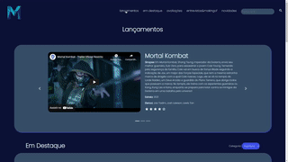
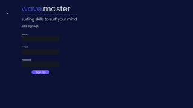
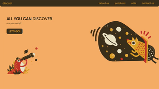

# hi! 😁

I'm **João**, currently studying to become a **software engineer**! 👨🏽‍💻

*//sou o joão e curso engenharia de software na puc minas* 

#### 🌍 *"close you eyes: see the world inside"* 🌍
- 📍   belo horizonte, brasil
- 💻 front-end development enthusiast
-  🎨 design & interface lover
- 📸   freelancer photographer (check out my [portifolio](https://mairinqueph.46graus.com/))

#### some of my projects 📕

- ***'MaiFilmes'*** - responsive movies webpage 

- ***'wave.master'*** - login screen made with reactjs

- ***'discozi'*** - login screen in html & css

 
  
  

 

