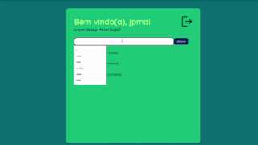

# hi! 😁

I'm **João**, currently studying to become a **software engineer**! 👨🏽‍💻

*//sou o joão e curso engenharia de software na puc minas* 

- 📍   belo horizonte, brasil
- 💻 front-end development 
-  🎨 user interface & experience
- 👨🏽‍💻  software development intern - [arkmeds](https://www.arkmeds.com/) 

#### 📕 newest project 📕

- ***'ToDoList'*** - classic to do app made with django 3.0 [webpage](https://github.com/jpmairinque/portal.maifilmes) 

 
 
  
  
  
  
  
  
 
   

##

  
  
 

